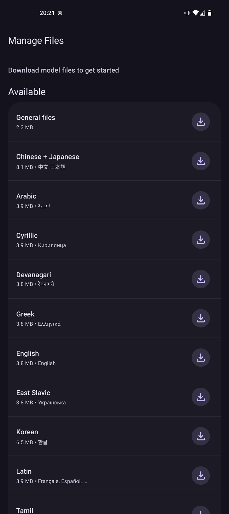
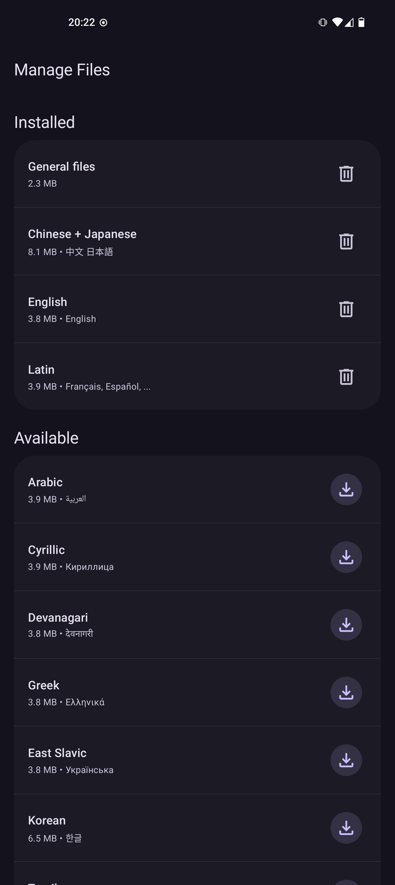
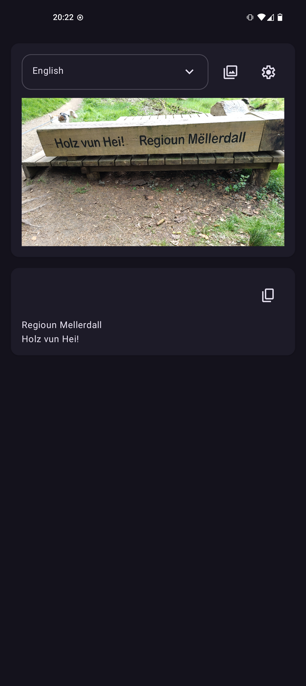

# OCR

OCR app based on [rust-paddle-rs](https://github.com/zibo-chen/rust-paddle-ocr) ([PaddleLite](https://paddleclas.readthedocs.io/en/latest/extension/paddle_mobile_inference_en.html)).

It's a proof of concept, works fine, but it's much slower than tesseract (and it catches way more than tesseract as well..)

## Screenshots

